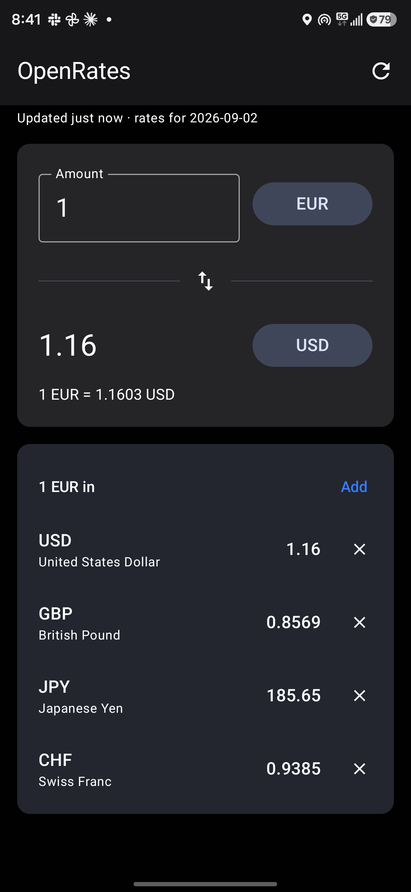
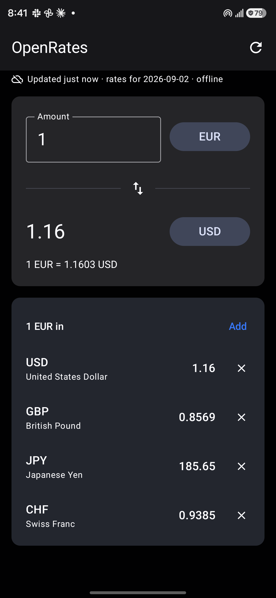

# OpenRates

A currency converter for Android with **no ads, no trackers, no accounts** — and one
that keeps working when you have no signal.

It reads reference rates from the [Frankfurter](https://frankfurter.dev) API (European
Central Bank data), caches them on the device, and converts from that cache whenever the
network is unavailable.

| Live | Offline |
| --- | --- |
|  |  |

## What it does

- Convert between **164 currencies**, with a searchable picker and a swap button.
- A **watchlist**: see one amount in several currencies at once.
- **Works offline.** Rates are cached on every successful refresh; if a refresh fails the
  app keeps showing the last good rates and says so, instead of showing nothing.
- **Refresh button** with a plain-language freshness line:
  `Updated 3 min ago · rates for 2026-09-02`, plus a cloud-off icon when offline.
- Remembers your amount, pair and watchlist between launches.
- One permission in the manifest: `INTERNET`. No analytics, no ad SDK, no third-party
  libraries beyond OkHttp, kotlinx.serialization and Jetpack Compose.

## How the rates work

The app uses two Frankfurter v2 endpoints, each for what it is best at:

| Endpoint | Used for |
| --- | --- |
| `GET /v2/rates?base=EUR` | The **offline snapshot** — every currency in one ~10 KB response. |
| `GET /v2/rates?base=EUR&quotes=A,B,C` | **Live rates** for the currencies on screen, in a single request. |
| `GET /v2/currencies` | Currency display names, cached once. |

**Every pair is crossed from EUR.** Both live and cached rates are fetched against EUR,
and any other pair is triangulated locally:

```
rate(A → B) = rate(EUR → B) / rate(EUR → A)
```

So a single cached response covers every pair the app offers, not just the ones you looked
at while online. It is also more precise than asking for the pair directly. A pair is
printed to a few decimals, which is plenty for EUR → HKD (8.9136) but leaves two or three
digits from a currency with small units: 1,000,000 KRW → GBP comes out as 560.00 instead
of 556.39, and IDR → gold as 0. The EUR legs keep five significant digits, so the cross
stays within about 0.002% for every pair. Two details the API forces you to handle, both of which the app respects:

- `/v2/rates` returns a **flat JSON array**, not a map keyed by currency.
- Quote **dates differ per currency** — illiquid ones lag by a day — so the date is stored
  per currency and the pair's own date is what gets displayed.

Writes to the cache go through a temp file and a rename, so a failed refresh or a kill
mid-write can never replace good rates with a truncated file.

## Build and run

Requires JDK 17 and the Android SDK (compileSdk 36).

```bash
./gradlew installDebug          # build and install on a connected device
./gradlew test                  # JVM unit tests: conversion math, API parsing
./gradlew connectedAndroidTest  # end-to-end tests on a connected device
./gradlew assembleRelease       # minified release APK (~1.5 MB, unsigned)
```

`local.properties` needs `sdk.dir=/path/to/Android/Sdk` (it is gitignored; Android Studio
writes it for you).

To ship a release build, add a signing config or sign the unsigned APK yourself:

```bash
$ANDROID_HOME/build-tools/36.1.0/apksigner sign --ks my-release.keystore \
    --out openrates.apk app/build/outputs/apk/release/app-release-unsigned.apk
```

## Tests

JVM (`app/src/test`) — conversion math including cross rates and unknown currencies,
Frankfurter parsing against recorded payloads via MockWebServer (single object, flat
array, per-quote dates, `422 invalid currency`), and amount parsing for `1,5` / `1.5`.

Instrumented (`app/src/androidTest`), run on a real device against the live API — launch
and convert, amount changes, swap, currency picker, watchlist add/remove, refresh, and the
offline guarantees: a repository pointed at an unreachable host still serves cached rates
and converts every pair, and a failed refresh never destroys the last good snapshot.

## Layout

```
app/src/main/java/com/andrea/openrates/
├── data/
│   ├── Conversion.kt        cross-rate math (pure, no Android deps)
│   ├── FrankfurterApi.kt    the four endpoints above
│   ├── Models.kt            wire + cache models
│   ├── RatesCache.kt        atomic JSON cache in filesDir
│   ├── RatesRepository.kt   cache-first, network-when-possible
│   └── Settings.kt          remembered pair, amount, watchlist
├── ui/
│   ├── ConverterScreen.kt   the single screen
│   ├── ConverterViewModel.kt
│   ├── CurrencyPickerSheet.kt
│   └── Format.kt            number and "3 min ago" formatting
└── MainActivity.kt
```

## Credits

Rates from [Frankfurter](https://frankfurter.dev), published by the European Central Bank.
Frankfurter is free and needs no API key; please be kind to it.

## License

MIT — see [LICENSE](LICENSE).
